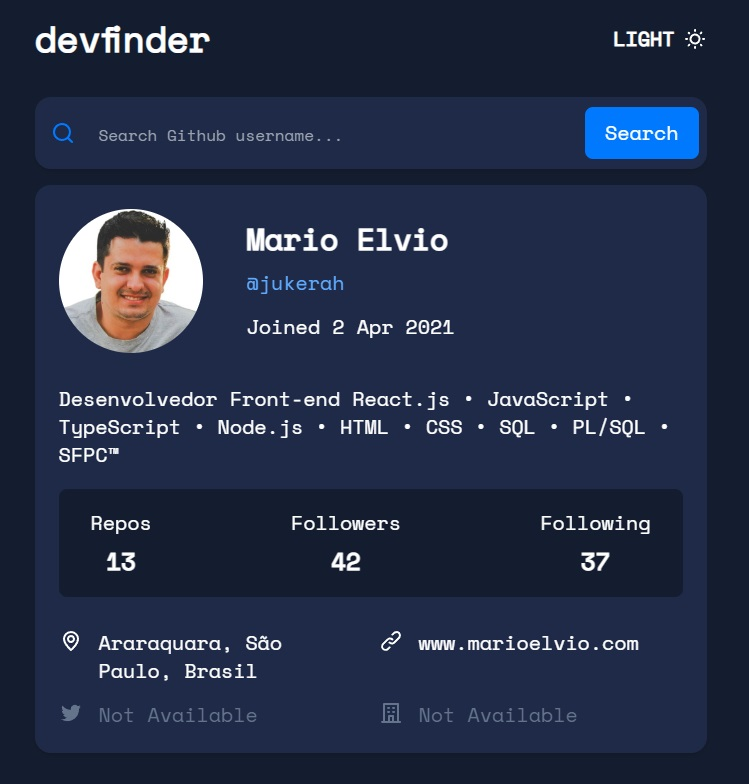

<h1 align="center">Frontend Mentor - DevFinder</h1>

 

<h2 id="about" align="center">Sumário</h2>

   * [Descrição do Projeto](#about)
   * [Demonstração do projeto](#demo-project)
   * [Features](#features)
   * [Pré-requisitos e instalação do projeto](#pre-req)

<h2 id="about" align="center">Descrição do Projeto</h2>

Este é um desafio do site Frontend Mentor. O desafio é construir uma aplicação para pesquisar usuário do GitHub e retornar dados do perfil.

Link do desafio no Frontend Mentor:

<a href="https://www.frontendmentor.io/challenges/github-user-search-app-Q09YOgaH6">https://www.frontendmentor.io/challenges/github-user-search-app-Q09YOgaH6</a>

Tecnologias utilizadas:

* React.js
* JavaScript
* Tailwind CSS
* API GitHub

<h2 id="demo-project" align="center">Demonstração do projeto</h2>
<a href="https://devfinder-j35p36vcx-jukamebaj-gmailcom.vercel.app/" align="left">https://devfinder-j35p36vcx-jukamebaj-gmailcom.vercel.app/</a>

<h2 id="features" align="center">Features</h2>

- [X] Header
- [X] SeachBar
- [X] ProfileCard
- [X] Loading
- [X] NotFound
- [X] ThemeColorButton
- [X] Deploy

<h2 id="pre-req" align="center">Pré-requisitos e instalação do projeto</h2>

#### Instalação:
#### `npm install`

#### Execução:
#### `npm start`

#### Build:
#### `npm run build`

### Autor
---

<a href="https://marioelvio.com">
 
  
 <a href="#" align="left">Frontend Mentor.</a>
 <b>Mario Elvio</b></a> 

Feito com ❤️ por Mario Elvio 👋🏽 Entre em contato!

